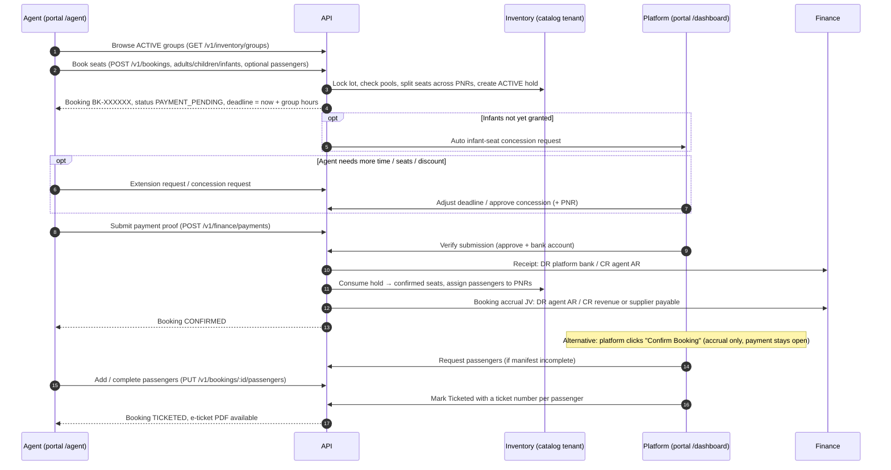
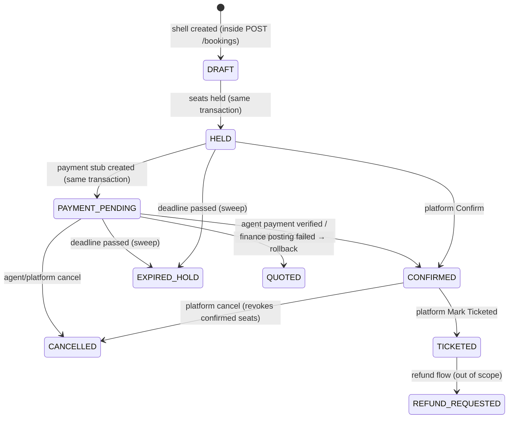

# Group Tickets — End-to-End Booking Flow (Agent & Platform)

> **Scope.** This document describes how a group ticket is booked, from the moment an agent opens the
> catalogue to the moment the booking is **TICKETED**. It covers the agent dashboard, the platform
> dashboard, the API, inventory, group PNRs, concessions, deadlines and finance.
>
> **Out of scope.** Creating and editing groups on the platform. We assume a group (selling group)
> already exists, is **ACTIVE**, has at least one **OPEN** inventory lot (cabin), a fare, and
> optionally its airline PNRs loaded.
>
> Written against branch `feat/umrah-packages` (2026-09-30). File references point to the code that
> implements each rule, so the document can be re-checked when the code changes.

---

## Table of contents

1. [Actors and dashboards](#1-actors-and-dashboards)
2. [Core concepts you need first](#2-core-concepts-you-need-first)
3. [The whole flow at a glance](#3-the-whole-flow-at-a-glance)
4. [Booking status reference](#4-booking-status-reference)
5. [Step 1 — Agent browses groups](#5-step-1--agent-browses-groups)
6. [Step 2 — Agent books seats (New Booking screen)](#6-step-2--agent-books-seats-new-booking-screen)
7. [Step 3 — What the server does when seats are booked](#7-step-3--what-the-server-does-when-seats-are-booked)
8. [Step 4 — Booking on hold: what the agent can do](#8-step-4--booking-on-hold-what-the-agent-can-do)
9. [Step 5 — Concessions: extra child seats, infant seats, discount](#9-step-5--concessions-extra-child-seats-infant-seats-discount)
10. [Step 6 — Payment deadline, extensions and expiry](#10-step-6--payment-deadline-extensions-and-expiry)
11. [Step 7 — Payment and confirmation](#11-step-7--payment-and-confirmation)
12. [Step 8 — Passenger manifest after confirmation](#12-step-8--passenger-manifest-after-confirmation)
13. [Step 9 — Ticketing](#13-step-9--ticketing)
14. [Cancellation (any time before ticketing)](#14-cancellation-any-time-before-ticketing)
15. [Group PNR allocation in detail](#15-group-pnr-allocation-in-detail)
16. [Pricing in detail](#16-pricing-in-detail)
17. [Finance and ledger effects per step](#17-finance-and-ledger-effects-per-step)
18. [Platform dashboard reference](#18-platform-dashboard-reference)
19. [Agent dashboard reference](#19-agent-dashboard-reference)
20. [Realtime updates](#20-realtime-updates)
21. [Documents (PDFs and manifests)](#21-documents-pdfs-and-manifests)
22. [API endpoint reference](#22-api-endpoint-reference)
23. [Permissions](#23-permissions)
24. [Error codes an operator will see](#24-error-codes-an-operator-will-see)
25. [Known gaps and gotchas](#25-known-gaps-and-gotchas)

---

## 1. Actors and dashboards

| Actor                 | Who                                                                                     | Where they work          | What they do in this flow                                                                                                         |
| --------------------- | --------------------------------------------------------------------------------------- | ------------------------ | --------------------------------------------------------------------------------------------------------------------------------- |
| **Agent**             | A travel agency user (agent tenant, `principalKind = "agent"`, bound to one `agencyId`) | Portal, `/agent/...`     | Browse groups, book seats, add passengers, request concessions/extensions, submit payment proof, download documents               |
| **Platform operator** | Al-Asad staff (consolidator / platform tenant, `principalKind = "platform"`)            | Portal, `/dashboard/...` | Review bookings, approve concessions, adjust deadlines, verify agent payments, confirm, request passengers, issue tickets, cancel |
| **System**            | API + BullMQ worker                                                                     | —                        | Seat holds, PNR allocation, hold-expiry sweep, finance postings, realtime push                                                    |

**Multi-tenant shape (important).** Inventory (groups, lots, PNRs, holds) lives on the **platform
(catalog) tenant**. The booking row, its passengers, payments and PNR allocations live on the
**agent's tenant**. Every booking step that touches inventory switches into the catalog tenant
context (`asInventoryTenant` in `apps/api/src/modules/bookings/services/booking-engine.service.ts`).
Agents never pick a tenant; `InventoryTenantScopeService.resolveForActor` resolves the catalog
tenant from the agent's JWT.

---

## 2. Core concepts you need first

| Concept                         | Model                                         | Meaning                                                                                                                                                                                                                                                    |
| ------------------------------- | --------------------------------------------- | ---------------------------------------------------------------------------------------------------------------------------------------------------------------------------------------------------------------------------------------------------------- |
| **Group** (selling group)       | `SellingGroup`                                | The sellable departure: code, route, currency, `status` (must be `ACTIVE`), `paymentDeadlineHours` (default 24), `showAvailableSeats`, `fareRuleRefs` (fare matrix per cabin and passenger kind)                                                           |
| **Flight segments**             | `FlightSegment` + `SellingGroupFlightSegment` | The legs (outbound/inbound) shown on the flight banner and PDFs                                                                                                                                                                                            |
| **Inventory lot** (cabin / SKU) | `InventoryLot`                                | One cabin bucket of a group. Holds three seat pools: **adult** (`seatsTotal/Held/Confirmed`), **child** (`childSeats*`), **infant** (`infantSeats*`). `status` must be `OPEN` to book. `fareAmount` is the adult sell fare; `costAmount` is supplier cost  |
| **Group PNR**                   | `GroupPnr`                                    | An airline PNR block inside a lot: `allocatedSeats`, `heldSeats`, `confirmedSeats`, `availableSeats`, `sortOrder`, `isActive`, optional `paxKind` (CHILD/INFANT-only PNR). Status is derived: `AVAILABLE`, `LOW_INVENTORY` (≤10% left), `FULL`, `INACTIVE` |
| **Booking**                     | `Booking`                                     | The agent's order. Reference `BK-XXXXXX`. Carries the seat mix (`bookedAdults/Children/Infants`), money (`fareSubtotalAmount`, `discountAmount`, `totalAmount`), deadlines (`paymentDeadlineAt`, `heldUntil`), `rowVersion`                                |
| **Seat hold**                   | `InventoryHold`                               | The reservation of seats on a lot for a booking. `ACTIVE` → `CONSUMED` (on confirm) / `RELEASED` (cancel) / `EXPIRED` (deadline passed)                                                                                                                    |
| **PNR allocation**              | `BookingPnrAllocation`                        | How many of the booking's seats sit on each PNR (`heldSeats`, `confirmedSeats`)                                                                                                                                                                            |
| **Passenger**                   | `BookingPassenger` (+ `PassengerDocument`)    | Name, title, kind, DOB, nationality, passport no./expiry, assigned `groupPnrId`, `ticketNumber`                                                                                                                                                            |
| **Payment**                     | `Payment`                                     | Payable stub created at hold (`CREATED`); becomes `CAPTURED` when settled, `CANCELLED`/`FAILED` on expiry                                                                                                                                                  |
| **Concession request**          | `BookingConcessionRequest`                    | Extra child seats, infant seats or a discount. `REQUESTED` → `APPROVED` / `REJECTED`                                                                                                                                                                       |
| **Agent payment submission**    | `AgentPaymentSubmission`                      | Agent's payment proof (`PAY-…`). `PENDING_VERIFICATION` → `VERIFIED` / `REJECTED`                                                                                                                                                                          |
| **Inventory movement**          | `InventoryMovement`                           | Append-only ledger of seat changes: `HOLD`, `RELEASE_HOLD`, `HOLD_EXPIRED`, `CONFIRM`, `CANCEL_BOOKING_ADJUSTMENT`, …                                                                                                                                      |

### Passenger mix rules (enforced by both UI and API)

Source: `packages/validation/src/booking-seat-manifest.ts`, `booking-passenger-rules.ts`.

- **At least 1 adult.**
- **Children ≤ floor(adults / 10) + granted child seats.** One child per ten adults is automatic;
  more needs a platform-approved concession (see §9).
- **Infants ≤ adults** (one lap infant per adult).
- **Infants do not use adult or child seats.** Seats taken from inventory = adults + children
  (`inventorySeatCount`). Infants need an infant fare on the cabin; infant seats beyond what the
  platform has granted become an automatic infant-seat request (see §7.4).
- Passenger ages (UI, `booking-types.ts`): adult ≥ 12 years, child 2–11 years, infant ≤ 24 months.
- Passport must be valid for 6+ months (UI); the API rejects expired passports
  (`booking.passport_expired`).
- The same person (name + DOB + kind) cannot appear twice in one booking
  (`booking.duplicate_passenger_in_payload`).

---

## 3. The whole flow at a glance



**Happy path in one line:** `PAYMENT_PENDING` → _(agent pays, platform verifies)_ → `CONFIRMED` →
_(passengers complete)_ → `TICKETED`.

---

## 4. Booking status reference



| Status                               | Meaning                                                                                                                                                             | Seats     | Agent sees                     |
| ------------------------------------ | ------------------------------------------------------------------------------------------------------------------------------------------------------------------- | --------- | ------------------------------ |
| `DRAFT` / `QUOTED`                   | Pre-hold shell. With the current flow a booking passes through these inside one transaction; you only see them after a failed finance post rolled the checkout back | none      | "Pending"                      |
| `HELD`                               | Seats held, payment stub not yet created (transient)                                                                                                                | held      | "On hold"                      |
| `PAYMENT_PENDING`                    | Seats held, waiting for payment. **Normal resting state after booking**                                                                                             | held      | "Awaiting payment" + countdown |
| `AWAITING_RECEIPT` / `RECEIPT_ADDED` | Legacy supplier-receipt path (see §11.4)                                                                                                                            | held      | —                              |
| `CONFIRMED`                          | Paid or platform-confirmed. Seats moved from held to confirmed; passengers assigned to PNRs                                                                         | confirmed | "Confirmed" + passenger phase  |
| `TICKETED`                           | Ticket numbers issued for every passenger                                                                                                                           | confirmed | "Ticketed"                     |
| `EXPIRED_HOLD`                       | Deadline passed before confirmation. Seats released                                                                                                                 | released  | "Expired"                      |
| `CANCELLED`                          | Cancelled by agent or platform. Seats released / revoked                                                                                                            | released  | "Canceled"                     |
| `REFUND_*`                           | Refund lifecycle after confirmation (not covered here)                                                                                                              | —         | —                              |

**Passenger phase** (a second badge, `resolvePassengerFulfillmentPhase`):

| Phase                 | When                                                          |
| --------------------- | ------------------------------------------------------------- |
| `Hold`                | Booking is in any pre-confirm status                          |
| `Booked`              | `CONFIRMED` with no booked seat count                         |
| `Passenger Pending`   | `CONFIRMED`, passengers entered < adults + children + infants |
| `Ready For Ticketing` | `CONFIRMED`, passengers entered = adults + children + infants |
| `Ticketed`            | `TICKETED`                                                    |

---

## 5. Step 1 — Agent browses groups

**Screen:** `/agent/groups` (`apps/portal/src/app/(app)/agent/groups/page.tsx`)

- Lists only **ACTIVE** groups from the consolidator catalog, 12 per page with infinite scroll.
- **Filters:** airline, sector (route), trip type (one way / round trip).
- **Sort:** departure date, airline, price, available seats, recently added.
- Each card shows route, dates, airline, cabin(s), sell price, and an inventory bar.
- **Seat counts are hidden** when the platform set `showAvailableSeats = false` on the group; the
  group stays bookable, the agent just doesn't see the number (`agentCabinSeatHint`).
- API: `GET /v1/inventory/groups?status=ACTIVE&...`. Agent JWTs are resolved to the catalog tenant
  and passed through buyer-safe visibility filters (no cost prices, no internal notes).

**Group detail:** `/agent/groups/[id]`

- Flight banner (legs, times, airline), cabins with price and availability, **Payment Deadline**
  (e.g. "24 hours after booking"), live/offline indicator.
- **Book** button → `/agent/bookings/new?groupId=<id>` (optionally `&cabin=<code>`).

---

## 6. Step 2 — Agent books seats (New Booking screen)

**Screen:** `/agent/bookings/new?groupId=…` → `BookingFlow`
(`apps/portal/src/app/(app)/agent/bookings/_components/booking-flow.tsx`).
The group is re-fetched every 30 s so availability stays fresh.

### 6.1 Sections on the screen

1. **Flight banner** — itinerary of the group.
2. **Select Cabin Class** — shown only when the group has more than one cabin. Sold-out cabins are
   disabled. Each option shows label, seat hint and sell price.
3. **Passenger Entry Mode**
   - **Add Passengers Later** (default) — buy seats now, enter passport details on the booking page
     before ticketing.
   - **Add Passengers Now** — enter every passenger before seats are held.
4. **Select Passengers** — Adults / Children / Infants counters (`PassengerCounter`), with live caps:
   - Adults ≤ cabin available seats (or adult-pool availability when the cabin has a separate child
     pool).
   - Children ≤ `floor(adults / 10)` and ≤ child-pool availability. Extra children need a concession
     _after_ booking (§9).
   - Infants ≤ adults, and only when the cabin has an infant fare (otherwise locked at 0).
5. **Price Summary** (`FareBreakdown`) — adult fare × adults + child fare × children + infant fare ×
   infants (see §16).
6. **Passenger forms** (Add Now mode only) — grouped by Adult / Child / Infant. Fields: title
   (Mr/Mrs/Ms/Miss/Mstr), given name, surname (upper-cased), passport number, date of birth, passport
   expiry (6+ months), nationality (3-letter code), optional passport scan.
7. **Terms checkbox** — must be ticked to submit.
8. **Submit** → creates the booking.

### 6.2 What the browser sends

`POST /v1/bookings`

```json
{
  "agencyId": "<agent's agency>",
  "currency": "PKR",
  "idempotencyKey": "<stable per attempt>",
  "inventoryLotId": "<cabin lot id>",
  "adults": 20,
  "children": 2,
  "infants": 1,
  "passengers": [/* only in Add Now mode; must equal adults+children+infants */]
}
```

- If the cabin object has no `lotId`, the UI looks up the group board and picks the first **OPEN**
  lot of that cabin class with seats left.
- **Double-submit / network-drop protection.** The idempotency key is stored in `sessionStorage`
  keyed by agency + group + cabin + seat mix (`lib/booking-draft-resume.ts`). If the request died in
  transit, the next submit reuses the key and the server **replays** the same booking instead of
  holding seats twice. The key is dropped when the server rejected the booking itself.
- On success: toast "Booking ready — Reference BK-… · Awaiting platform payment" and redirect to
  `/agent/bookings/<id>`.
- The API always takes `agencyId` from the agent's JWT scope, never from the body
  (`resolveActorAgencyScope`).

---

## 7. Step 3 — What the server does when seats are booked

**Code path:** `BookingsController.draft` → `CreateBookingHandler` →
`BookingEngineService.placeBookingAndHold` → `checkoutBookingToPaymentPendingInTx`.

### 7.1 Validations before anything is written

1. Agency belongs to the tenant.
2. Seat mix valid (≥1 adult, child ratio, infants ≤ adults) → else `booking.place_requires_seat_manifest`.
3. `inventoryLotId` present → else `booking.place_requires_inventory_lot`.
4. If passengers were sent: no duplicates, child mix OK, count and per-kind counts ≤ booked seats.
5. Lot exists on the catalog tenant → else `inventory_lot.not_found`.
6. **Idempotency replay:** if a booking with the same key exists → return it (resume checkout if it
   was left in DRAFT/QUOTED; error if it is CANCELLED/EXPIRED_HOLD).

### 7.2 One database transaction

Everything below commits together or not at all:

1. **Create booking shell** — status `DRAFT`, reference `BK-` + 6 hex chars (retried up to 5× on
   collision), currency, lot, booked seat mix, `paymentDeadlineAt = now + group.paymentDeadlineHours`.
2. **Insert passengers** (if sent).
3. **Row-lock the inventory lot** (prevents overselling under concurrency).
4. **Check the group and lot:** group `ACTIVE` (`selling_group.not_active_for_holds`), lot `OPEN`
   (`inventory_lot.frozen_no_new_holds` / `inventory_lot.closed_no_new_holds`).
5. **Check each seat pool** (adult, child, infant) has room → `inventory.adult_pool_oversell_prevented`
   etc.
6. **Check deadline** is in the future → `booking.payment_deadline_elapsed`.
7. **Split seats across group PNRs** (§15). If no PNR has room → `group_pnr.overflow_all_full`.
8. **Create the hold** — `InventoryHold` `ACTIVE`, `seatsHeld = adults + children`,
   `expiresAt = deadline`.
9. **Write movement** — `InventoryMovement` type `HOLD`.
10. **Increment lot counters** (`seatsHeld`, `childSeatsHeld`, `infantSeatsHeld` as applicable),
    bump `rowVersion`.
11. Booking → `HELD`, `heldUntil = deadline`.
12. **Price the booking** from the lot fare and the group fare matrix (§16).
13. **Create payment stub** — `Payment` `CREATED`, `amountPayable = totalAmount`.
14. Booking → **`PAYMENT_PENDING`**.

### 7.3 After the transaction

- Audit: `BOOKING_CREATED`, `BOOKING_PAYMENT_STARTED`.
- Realtime: `booking.created`, then `booking.payment_pending`.
- Finance: `postOnBookingHeld` — in the default journal-accrual mode nothing is posted to the GL at
  hold; the booking JV waits for confirmation so cancelled/expired holds never touch the ledger.
- **If finance posting throws**, the checkout is compensated: draft invoice cancelled, payment
  cancelled, holds released, booking set back to `QUOTED`, error returned to the agent.

### 7.4 Automatic infant-seat request

If the agent booked infants and the platform has not yet granted that many infant seats
(`bookedInfants - grantedInfantSeats > 0`), the server creates an **INFANT_SEATS concession request**
automatically (`ensureCheckoutInfantSeatRequest`). It appears in the platform concessions queue so the
platform can approve it and put the infants on a PNR.

---

## 8. Step 4 — Booking on hold: what the agent can do

**Screen:** `/agent/bookings/[id]` (`apps/portal/src/app/(app)/agent/bookings/[id]/page.tsx`)

Header: reference (copy button), status badge, passenger-phase badge, "x / y passengers", created
time, confirmed time, Live/Offline indicator, Refresh.

| Action                                | Shown when                                                                               | What happens                                                              |
| ------------------------------------- | ---------------------------------------------------------------------------------------- | ------------------------------------------------------------------------- |
| **Request Payment Extension**         | Status is HELD / PAYMENT_PENDING / AWAITING_RECEIPT / RECEIPT_ADDED and hold not expired | Opens a modal to request extra minutes + reason (§10.2)                   |
| **Cancel Booking**                    | DRAFT / QUOTED / HELD / PAYMENT_PENDING and not expired                                  | Confirmation dialog → seats released, booking `CANCELLED` (§14)           |
| **Invoice**                           | Printable status, not cancelled/expired                                                  | Opens the booking invoice PDF                                             |
| **Print Reservation**                 | Pre-confirm statuses                                                                     | Reservation slip PDF, status and ticket no. show "[on hold]"              |
| **Print Confirmation / Print Ticket** | CONFIRMED / TICKETED                                                                     | Confirmation PDF / e-ticket PDF (+ **Email ticket** in the ticket dialog) |

Panels on the page:

- **Countdown card / expiration banner** — time left until `heldUntil`. When it hits zero the page
  shows "Hold expired — seats released".
- **Fare / payment summary** — booking value, amount payable, payment status, payment deadline.
- **Concessions panel** — request extra child seats or a discount; see history (§9).
- **Passengers panel** — add or edit passengers (allowed from DRAFT up to and including CONFIRMED);
  attach passport scans; passport OCR (MRZ text is parsed via
  `POST /v1/bookings/passport-ocr/extract-text`).
- **Group information card** and **lifecycle timeline**.

> There is **no "Pay" button on the booking page.** Payment is made through
> **Finance → Payments → Submit payment** (§11.1).

---

## 9. Step 5 — Concessions: extra child seats, infant seats, discount

A concession is anything the agent cannot grant themselves. Code:
`apps/api/src/modules/bookings/services/booking-concession.service.ts`. UI: `BookingConcessionsPanel`
on both booking pages, plus queues at `/agent/bookings/concessions` and
`/dashboard/bookings/concessions`.

### 9.1 Kinds

| Kind           | Why                                                                        | Allowed booking statuses                                                                                     |
| -------------- | -------------------------------------------------------------------------- | ------------------------------------------------------------------------------------------------------------ |
| `CHILD_SEATS`  | More children than the automatic 1-per-10-adults                           | DRAFT … CONFIRMED                                                                                            |
| `INFANT_SEATS` | Put infants on inventory / a PNR (auto-created at booking, §7.4)           | DRAFT … CONFIRMED                                                                                            |
| `DISCOUNT`     | Fixed amount off per seat, optionally different per adult / child / infant | DRAFT … RECEIPT_ADDED — **not after confirmation** (`booking.concession_discount_not_allowed_after_confirm`) |

### 9.2 Rules

- **Discount:** only one _approved_ discount per booking (`booking.concession_discount_already_granted`)
  and one pending at a time. Discounts are fixed per-seat amounts (percent is no longer supported).
  Total discount = per-seat value × seats, clamped to the fare subtotal. Values must be plain
  non-negative decimals.
- **Child / infant seats:** repeatable, but only one pending request of the same kind at a time
  (`booking.concession_request_already_pending`).
- Agents can only _request_; platform can _approve / reject / grant directly / revise_.

### 9.3 Agent side

On the booking page → **Request child seats** or **Request discount**, with an optional note for
platform review. `POST /v1/bookings/:id/concession-requests`. Status shows as REQUESTED / APPROVED /
REJECTED in the panel and in `/agent/bookings/concessions`.

### 9.4 Platform side

Queue: `/dashboard/bookings/concessions` (REQUESTED items, links to each booking). On the booking page:

| Action                                                    | Endpoint                                            | Effect                                                                                                                                                                                                                                                                                                                                     |
| --------------------------------------------------------- | --------------------------------------------------- | ------------------------------------------------------------------------------------------------------------------------------------------------------------------------------------------------------------------------------------------------------------------------------------------------------------------------------------------ |
| **Approve** (can adjust values first)                     | `POST /v1/bookings/concession-requests/:id/approve` | Child/infant: grows the lot's child/infant pool, raises `grantedChildSeats`/`grantedInfantSeats`, and — if a PNR code is given — appends a child/infant-only PNR. Seats are held or confirmed immediately if the booking already has live inventory. Discount: sets per-kind discount values and `discountAmount`, re-prices `totalAmount` |
| **Reject** (with note)                                    | `POST …/:id/reject`                                 | Request → REJECTED                                                                                                                                                                                                                                                                                                                         |
| **Add PNR** later                                         | `POST …/:id/pnr`                                    | "Leave blank to approve now and add the PNR later" — assigns the PNR afterwards                                                                                                                                                                                                                                                            |
| **Grant child seats / Grant discount** (no agent request) | `POST /v1/bookings/:id/concessions`                 | Same as approve, initiated by platform                                                                                                                                                                                                                                                                                                     |
| **Edit discount** (before confirm)                        | `PATCH /v1/bookings/:id/concessions/discount`       | Stored as a new APPROVED concession row; send `"0"` to remove                                                                                                                                                                                                                                                                              |
| **Split child/infant seats onto their own PNR**           | `POST /v1/bookings/:id/passenger-seat-pnr`          | Works for any child/infant seat, including the automatic 1-per-10 child                                                                                                                                                                                                                                                                    |

**Finance:** if the booking's accrual JV already exists (i.e. after confirmation), each concession
posts its own delta JV — child/infant seats raise the receivable, discount reduces it
(`postOnBookingConcessionGranted`, `postOnBookingConcessionDiscount`). Before confirmation nothing is
posted; the accrual at confirm simply uses the updated total.

Realtime: `booking.concession.approved`, `booking.concession.rejected`, `booking.repriced`.

---

## 10. Step 6 — Payment deadline, extensions and expiry

### 10.1 How the deadline is set

- `paymentDeadlineAt = booking created at + group.paymentDeadlineHours` (minimum 1 hour; default 24).
- If the group has no hours configured, a 15-minute fallback applies.
- The seat hold's `expiresAt` equals the booking deadline. The agent sees a live countdown; the
  platform bookings list shows the same countdown.

### 10.2 Extension request (agent)

- Button **Request Payment Extension** → modal with duration and reason →
  `POST /v1/bookings/:id/extension-request`.
- Allowed statuses: HELD, PAYMENT_PENDING, AWAITING_RECEIPT, RECEIPT_ADDED.
- This does **not** change the deadline. It writes an audit entry and pushes a notification:
  - Platform: "Extension requested — <Agency> (BK-…) requested +N min" linking to the booking.
  - Agent: "Requested +N min — awaiting platform approval".

### 10.3 Adjust deadline (platform)

- Button **Adjust payment deadline** on `/dashboard/bookings/[id]` →
  `POST /v1/bookings/:id/extension-approve` with `extensionMinutes`.
- Range **−1440 … +1440 minutes, in steps of 15** (negative = shorten). New deadline must be in the
  future and at least 15 minutes after the booking was created.
- Updates `paymentDeadlineAt`, `heldUntil` **and** the active hold's `expiresAt` in one transaction.
- Audit `deadline_adjusted`; realtime `booking.extended`.
- **Reject:** `POST /v1/bookings/:id/extension-reject` (audit + notification to agent).

### 10.4 Automatic expiry

- A repeatable BullMQ job sweeps expired holds every **45 s** (`AIRDESK_INVENTORY_SWEEP_EVERY_MS`,
  minimum 5 s; disable with `AIRDESK_INVENTORY_SWEEP_ENABLED=false` — then holds never expire).
- For each hold past `expiresAt`: hold → `EXPIRED`, movement `HOLD_EXPIRED`, lot and PNR held counters
  decremented.
- The booking bridge (`BookingInventoryHoldExpiryBridgeHandler`) then, **only if the booking is still
  HELD or PAYMENT_PENDING**: payment `CREATED` → `CANCELLED`, `AUTHORIZED` → `FAILED`, booking →
  `EXPIRED_HOLD`, audit, realtime `booking.hold_expired`, finance reversal.
- Expired bookings show under the agent's **Expired** tab. The agent must create a new booking; an
  expired booking cannot be revived.
- Ops backfill: `POST /v1/bookings/jobs/sweep-stale-holds` (dry run unless `apply: true`) repairs
  bookings whose hold vanished without the status flipping.

---

## 11. Step 7 — Payment and confirmation

There are **two supported ways** a booking reaches `CONFIRMED`, plus one legacy path.

### 11.1 Path A (normal) — Agent pays, platform verifies

**Agent: submit payment proof**

- Screen: **Finance → Payments** (`/agent/finance/payments`) → **Submit payment**.
- Form fields: payment number and date (auto), **Booking (optional)** — dropdown lists the agent's
  bookings with an outstanding amount, excluding cancelled/expired; picking one pre-fills amount and
  currency — **Amount\***, **Payment method\*** (Bank transfer / Cash / Cheque / Card), **Reference\***
  (bank/transfer reference), remarks, **attachment(s)\*** (proof is mandatory).
- `POST /v1/finance/payments` → `AgentPaymentSubmission` `PENDING_VERIFICATION`, number `PAY-…`.
- Rejected if the booking is CANCELLED/EXPIRED_HOLD (`booking_not_eligible_for_payment_submission`).
- "Booking is optional" — the same form is used for wallet / advance deposits.

> Submitting proof does **not** stop the deadline clock. If verification will take longer than the
> remaining hold, the agent should request an extension (§10.2) or the platform should adjust the
> deadline.

**Platform: verify**

- Screen: `/dashboard/finance/agent-payments` (Agent payment approvals). Lists submissions awaiting
  approval with attachments.
- **Approve** → choose the platform bank/cash account that received the money →
  `POST /v1/finance/payments/submissions/:id/verify { approve: true, debitLedgerAccountId }`.
  1. Posts an **accounting receipt on the platform tenant**: DR selected bank / CR the agency's AR
     (applied against the agent's outstanding AR balance; any excess goes to the agent's prepaid
     wallet).
  2. Submission → `VERIFIED`, linked to the receipt; audit `AGENT_PAYMENT_VERIFIED`; realtime
     `finance.payment.verified`.
  3. **Auto-confirms the booking** (`BookingSettlementBridgeService`) if it is HELD /
     PAYMENT_PENDING / AWAITING_RECEIPT:
     - Hold consumed: held → confirmed on lot, pools and PNRs; movement `CONFIRM`.
     - Payment → `CAPTURED` (`provider = AGENT_PAYMENT_VERIFIED`, capture = full payable).
     - Booking → `CONFIRMED`, `confirmedAt` set, `heldUntil` cleared.
     - Passengers (if any) assigned to PNRs.
     - Booking accrual JV posted (§17). Audit `BOOKING_CONFIRMED` (channel
       `agent_payment_verified`). Realtime `booking.confirmed`.
  - If the booking had already expired or was cancelled, the receipt still posts (money was
    received) but the booking is not confirmed; the auto-confirm failure is logged, not raised.
- **Reject** (with notes) → submission `REJECTED`, realtime `finance.payment.rejected`. Booking is
  unchanged; the agent can resubmit.

### 11.2 Path B — Platform confirms directly ("Confirm Booking")

- Button **Confirm Booking** on `/dashboard/bookings/[id]`, shown when status is HELD /
  PAYMENT_PENDING and the hold is not expired. Dialog: "This confirms the booking and secures the seats
  for <amount>. No receipt is required."
- `POST /v1/bookings/:id/confirm` with `expectBookingRowVersion` and an idempotency key
  (`confirm-<id>-<rowVersion>`).
- **Accrual-only confirmation** (`capturePayment: false`):
  - Seats consumed into confirmed inventory, passengers assigned to PNRs, booking → `CONFIRMED`.
  - **The payment stays `CREATED`** — the agent's AR stays open. The booking JV (DR agent AR) posts.
  - The agent pays later through Path A's form; the platform's verification posts the receipt against
    the AR balance (the booking is already confirmed, so the auto-confirm step is skipped).
- Use this when the platform trusts the agent (credit) or has received money outside the system.
- Replaying confirm on an already-confirmed booking returns the existing result (idempotent).

### 11.3 What "consume the hold" does (both paths)

`InventoryEngineService.consumeSeatHoldsIntoConfirmedInventory`:

- Active holds → `CONSUMED`.
- Lot: `seatsHeld` ↓, `seatsConfirmed` ↑ (and the child/infant pool equivalents).
- Each `BookingPnrAllocation`: `heldSeats` → `confirmedSeats`; each `GroupPnr` counters updated and
  status re-derived.
- Emits `InventoryLotAdjusted` and a group-PNR tape event → platform group board updates live.

### 11.4 Legacy path — supplier receipt then confirm seats

Still in the API, not exposed on the current platform booking page:

1. `POST /v1/bookings/:id/supplier-receipts` — record airline/supplier receipt (reference, date,
   amount, currency, method, attachment). Allowed from HELD / PAYMENT_PENDING / AWAITING_RECEIPT.
   Booking → `RECEIPT_ADDED`.
2. `POST /v1/bookings/:id/confirm-seats` — capture payment (capped at the receipt amount), consume
   seats, `CONFIRMED`.
3. `POST /v1/bookings/:id/payments/capture` — deprecated alias of step 2.

---

## 12. Step 8 — Passenger manifest after confirmation

Agents often buy seats first and send names later ("Add Passengers Later").

- After `CONFIRMED`, the passenger-phase badge shows **Passenger Pending** until passengers =
  adults + children + infants, then **Ready For Ticketing**.
- **Platform → Request Passengers** (button on `/dashboard/bookings/[id]`, shown when CONFIRMED and
  manifest incomplete) → `POST /v1/bookings/:id/request-passengers`. Sets
  `passengerDetailsRequestedAt`; realtime `booking.passengers_requested`; agent is notified "complete
  the manifest". Fails if the manifest is already complete.
- **Agent → Passengers panel** on the booking page: add/edit passengers → `PUT
/v1/bookings/:id/passengers` (full replace). Counts per kind can never exceed what was booked.
  Allowed up to and including `CONFIRMED`; **locked once TICKETED** (`booking.passenger_edit_window_closed`).
- Passport number/expiry can also be set per passenger (`PATCH …/passengers/:pid/travel-document`)
  and passport scans attached (`POST …/passengers/:pid/passports`, with OCR).
- Every save re-runs passenger → PNR assignment (a no-op until the booking has PNR allocations), so
  new passengers land on the right PNR.
- When the manifest becomes complete: realtime `booking.passengers_ready_for_ticketing`.

---

## 13. Step 9 — Ticketing

**Who:** platform only (`bookings.ops.ticket`).

**Button:** **Mark Ticketed** on `/dashboard/bookings/[id]` — shown only when status is `CONFIRMED`
**and** the passenger manifest is complete.

**Dialog:** one ticket-number input per passenger.

**Request:** `POST /v1/bookings/:id/ticket`

```json
{
  "expectBookingRowVersion": 12,
  "passengerTickets": [{ "passengerId": "…", "ticketNumber": "2141234567890" }]
}
```

**Server checks (`markIssuedTicketed`):**

| Check                                      | Error                                            |
| ------------------------------------------ | ------------------------------------------------ |
| Booking is `CONFIRMED`                     | `booking.ticketing_requires_confirmed_inventory` |
| Row version matches (no concurrent edit)   | `booking.row_version_mismatch`                   |
| Passengers = adults + children + infants   | manifest-incomplete error                        |
| Ticket numbers provided                    | `booking.ticket_numbers_required`                |
| One ticket per passenger                   | `booking.ticket_assignment_count_mismatch`       |
| Each passenger belongs to this booking     | `booking.passenger_not_found_under_manifest`     |
| No duplicate ticket numbers in the booking | `booking.ticket_number_duplicate_in_booking`     |

**Effects:** ticket numbers normalized and saved on each passenger, PNR assignment re-run, booking →
**`TICKETED`**, audit (`ticketing: true`), finance milestone audit (no GL entry — revenue was already
recognised at confirmation), realtime `booking.ticketed`.

**After ticketing (agent and platform):** **Print Ticket** (e-ticket itinerary PDF), **Email ticket**
(to the signed-in user by default), passenger manifest export, airline manifests. Passenger edits and
discounts are closed; changes go through the refund flow.

---

## 14. Cancellation (any time before ticketing)

`POST /v1/bookings/:id/cancel` (`CancelBookingHandler` → `cancelOperationalBooking`).

| Booking status                                           | Who (per UI)       | What happens to seats                                                          |
| -------------------------------------------------------- | ------------------ | ------------------------------------------------------------------------------ |
| DRAFT, QUOTED, HELD, PAYMENT_PENDING                     | Agent and platform | Every active hold released (`RELEASE_HOLD`), lot/PNR held counters decremented |
| AWAITING_RECEIPT, RECEIPT_ADDED                          | Platform           | Same as above                                                                  |
| CONFIRMED (and TICKETED / REFUND_REQUESTED at API level) | Platform           | Confirmed seats **revoked** back to inventory (`CANCEL_BOOKING_ADJUSTMENT`)    |
| CANCELLED, EXPIRED_HOLD                                  | —                  | No-op                                                                          |

Then: booking → `CANCELLED`, `cancelledAt` set; audit `BOOKING_CANCELLED`; realtime
`booking.cancelled`; finance reversal (`reverseOnBookingTerminated` — voids AR / reverses any accrual
with immutable reversal JEs). The seat release commits first; if a side effect fails afterwards the
booking is still cancelled and the failure is logged for repair.

---

## 15. Group PNR allocation in detail

Code: `apps/api/src/modules/inventory/services/group-pnr.service.ts`.

**At hold (`assignBookingForNewHold`):**

- If the lot has no active PNRs, allocation is skipped (booking works without PNRs).
- Otherwise PNR rows are row-locked and seats are split **greedily in `sortOrder` order** (then
  creation time): fill the first PNR with free seats, overflow to the next, and so on.
  _Example:_ PNR `AB12CD` has 8 free, `EF34GH` has 30 free, booking needs 20 → 8 on `AB12CD`, 12 on
  `EF34GH`.
- Inactive and full PNRs are skipped. If total free < needed → `group_pnr.overflow_all_full`.
- One `BookingPnrAllocation` row per PNR used; PNR `heldSeats` ↑ and status re-derived. The booking's
  primary `groupPnrId` is the PNR that holds the largest share.

**At confirm:** allocations move held → confirmed.

**Passenger → PNR (`assignPassengersToPnrs`)**, run at confirm, on passenger saves and at ticketing:

- Each PNR can take as many passengers as the booking's allocation on it.
- PNRs reserved for a kind (`paxKind = CHILD` or `INFANT`, created by concessions) only take that
  kind; other passengers prefer general PNRs.
- Adults and children consume seats; infants follow their guardian's PNR.

**PNR status thresholds:** `FULL` when available ≤ 0, `LOW_INVENTORY` when available ≤ 10% of
allocated, `INACTIVE` when switched off.

**Platform view:** the group detail page (`/dashboard/groups/[id]`) shows the board with each PNR's
allocated / held / confirmed / available seats, updated live via `GroupPnrInventoryTape` events.

---

## 16. Pricing in detail

- **Adult fare** = lot `fareAmount`.
- **Child / infant fare** = from the group fare matrix `fareRuleRefs.cabins[<code>].passengerFares.CHILD.sell`
  / `.INFANT.sell`. The cabin is matched from the lot bucket code prefix (bucket `Y-2` → cabin `Y`),
  or the single cabin if there is only one. If no child fare is set, the adult fare is used; with no
  infant fare, infants cannot be booked in the UI.
- **Fare subtotal** = adult × adults + child × children + infant × infants.
- **Tax and fee** = 0 on group bookings (fare is all-in).
- **Discount** (after concession) = per-seat values × seats, clamped to subtotal.
- **Total** = subtotal − discount. Currency comes from the lot's `fareCurrency` (falls back to the
  group/booking currency).
- All money is `Decimal(20,8)`; never floating point.
- The `Payment` stub's `amountPayable` is kept in sync with the booking total while it is `CREATED`.

---

## 17. Finance and ledger effects per step

Default mode is **journal accrual** (`BOOKING_FINANCE_ACCRUAL_MODE` unset or anything other than
`invoice`). Agents have no chart of accounts; their AR sub-ledger lives on the **platform tenant**.

| Step                            | GL effect                                                                                                                                                                                                                                                                                                                                                                              |
| ------------------------------- | -------------------------------------------------------------------------------------------------------------------------------------------------------------------------------------------------------------------------------------------------------------------------------------------------------------------------------------------------------------------------------------- |
| Seats held (PAYMENT_PENDING)    | **None.** Fare is quoted on the booking only                                                                                                                                                                                                                                                                                                                                           |
| Concession before confirm       | None (the confirm JV uses the updated total)                                                                                                                                                                                                                                                                                                                                           |
| Agent payment verified          | **Receipt JV** on platform: DR platform bank (chosen by approver) / CR agent AR. Excess → agent prepaid wallet                                                                                                                                                                                                                                                                         |
| Booking confirmed (either path) | **Booking accrual JV** once per booking (idempotency key `booking.accrual.<bookingId>`): DR agent AR / CR revenue — or CR supplier payable for pass-through groups with a supplier account. Narration like "20 adult fare, 2 child fare, 1 infant fare, seats booking - 23 seats, (PNR) AB12CD, ISB-JED-ISB". Supplier AP/COGS accrual on the inventory tenant when the lot has a cost |
| Concession after confirm        | Delta JV: seats ↑ receivable, discount ↓ receivable                                                                                                                                                                                                                                                                                                                                    |
| Ticketed                        | None (audit milestone only)                                                                                                                                                                                                                                                                                                                                                            |
| Cancelled / expired             | Reversal of any accrual/AR with immutable reversal entries                                                                                                                                                                                                                                                                                                                             |

Related memory notes: confirm is accrual-only; settlement posts at agent-payment approval, not at
confirm.

---

## 18. Platform dashboard reference

| Screen                  | Route                               | Used for                                                                                                                                                                                                                                                                                                                                                                                                                                                           |
| ----------------------- | ----------------------------------- | ------------------------------------------------------------------------------------------------------------------------------------------------------------------------------------------------------------------------------------------------------------------------------------------------------------------------------------------------------------------------------------------------------------------------------------------------------------------ |
| Bookings list           | `/dashboard/bookings`               | All agents' bookings: ref, agent, group/route, seats, amount, status, **deadline countdown**. Search + status filter (pending payment, awaiting payment, confirmed, expired, …). Links to agent ledger. **Export passenger list** (PDF/Excel) and **airline manifest** export                                                                                                                                                                                      |
| Booking detail          | `/dashboard/bookings/[id]`          | Buttons: **Confirm Booking**, **Adjust payment deadline**, **Cancel**, **Request Passengers**, **Mark Ticketed**, **Print Reservation / Confirmation / Ticket**, **Airline manifest export**, **Download Passenger Manifest**, Refresh. Panels: countdown, fare summary, payment status, concessions (approve/reject/grant/edit discount/add PNR), passengers, group info, lifecycle timeline. A **Start checkout** action appears only for DRAFT/QUOTED leftovers |
| Concession queue        | `/dashboard/bookings/concessions`   | All REQUESTED concessions across agents                                                                                                                                                                                                                                                                                                                                                                                                                            |
| Agent payment approvals | `/dashboard/finance/agent-payments` | Verify / reject agent payment proofs (select receiving bank account)                                                                                                                                                                                                                                                                                                                                                                                               |
| Group detail / board    | `/dashboard/groups/[id]`            | Live seat board per lot and PNR (held/confirmed/available), lot freeze/unfreeze                                                                                                                                                                                                                                                                                                                                                                                    |
| Notifications           | bell                                | "Extension requested", concession requests, payment submissions                                                                                                                                                                                                                                                                                                                                                                                                    |

---

## 19. Agent dashboard reference

| Screen                          | Route                          | Used for                                                                                                                   |
| ------------------------------- | ------------------------------ | -------------------------------------------------------------------------------------------------------------------------- |
| Groups                          | `/agent/groups`                | Browse and filter ACTIVE groups                                                                                            |
| Group detail                    | `/agent/groups/[id]`           | Itinerary, cabins, prices, payment deadline, **Book**                                                                      |
| New booking                     | `/agent/bookings/new?groupId=` | Choose cabin, passenger mix, entry mode, confirm terms, book                                                               |
| My bookings                     | `/agent/bookings`              | Tabs: **All**, **Pending** (awaiting payment), **Confirmed**, **Expired**, **Canceled**                                    |
| Booking detail                  | `/agent/bookings/[id]`         | Countdown, passengers, concessions, extension request, cancel, invoice, reservation/confirmation/ticket PDFs, email ticket |
| Concessions                     | `/agent/bookings/concessions`  | Status of all the agent's concession requests                                                                              |
| Payments                        | `/agent/finance/payments`      | **Submit payment** proof, see submission status                                                                            |
| Ledger / receivables / invoices | `/agent/finance/...`           | Outstanding balance per booking, receipts                                                                                  |
| Bank details                    | `/agent/bank-details`          | Platform bank accounts to pay into                                                                                         |

---

## 20. Realtime updates

The portal subscribes over socket.io (token-scoped; re-subscribes after workspace switch). **Push is a
hint — the page always refetches the booking from REST after an event.**

Booking topics: `booking.created`, `booking.payment_pending`, `booking.payment_updated`,
`booking.repriced`, `booking.concession.approved`, `booking.concession.rejected`, `booking.extended`,
`booking.receipt_added`, `booking.confirmed`, `booking.passengers_requested`,
`booking.passengers_replaced`, `booking.passengers_ready_for_ticketing`, `booking.document_ocr`,
`booking.ticketed`, `booking.cancelled`, `booking.hold_expired`, `booking.refund_requested`.

Inventory: `InventoryLotAdjusted`, `SeatHoldTerminated`, `GroupPnrInventoryTape` (group board).

Finance: `finance.payment.verified`, `finance.payment.rejected`, `finance.journal.posted`.

---

## 21. Documents (PDFs and manifests)

| Document                         | Endpoint                                            | Available                                                                                           |
| -------------------------------- | --------------------------------------------------- | --------------------------------------------------------------------------------------------------- |
| Reservation slip                 | `GET /v1/bookings/:id/reservation/pdf`              | QUOTED, HELD, PAYMENT_PENDING, AWAITING_RECEIPT, RECEIPT_ADDED (status/ticket no. show "[on hold]") |
| Confirmation                     | `GET /v1/bookings/:id/confirmation/pdf`             | CONFIRMED, TICKETED                                                                                 |
| E-ticket itinerary               | `GET /v1/bookings/:id/ticket/pdf`                   | TICKETED                                                                                            |
| Email e-ticket                   | `POST /v1/bookings/:id/ticket/email`                | TICKETED (default recipient: current user)                                                          |
| Passenger manifest (one booking) | `GET /v1/bookings/:id/passengers/export?format=xlsx | pdf`                                                                                                | Any booking with passengers |
| Passenger list (many)            | `GET /v1/bookings/export/passengers?bookingIds=…`   | Confirmed / ticketed                                                                                |
| Airline manifests                | platform export menu                                | Confirmed / ticketed with complete passports. Formats: Airblue, AirSial, Saudi                      |

---

## 22. API endpoint reference

All under `/v1`. Send `x-correlation-id` to trace a request through audits and events.
Mutations accept `expectBookingRowVersion` for optimistic locking.

### Catalogue

| Method | Path                          | Who             |
| ------ | ----------------------------- | --------------- |
| GET    | `/inventory/groups`           | agent, platform |
| GET    | `/inventory/groups/:id`       | agent, platform |
| GET    | `/inventory/groups/:id/board` | agent, platform |

### Booking lifecycle

| Method | Path                                            | Who                              | Purpose                                                                                                                                             |
| ------ | ----------------------------------------------- | -------------------------------- | --------------------------------------------------------------------------------------------------------------------------------------------------- |
| POST   | `/bookings`                                     | agent, platform                  | Create + hold + price + payment stub → PAYMENT_PENDING                                                                                              |
| GET    | `/bookings`                                     | agent, platform                  | List (filters: status, agencyId, search, pendingPaymentOnly, awaitingPaymentOnly, confirmedOnly, agentPendingOnly, expiredOnly, refundEligibleOnly) |
| GET    | `/bookings/:id`                                 | agent, platform                  | Detail                                                                                                                                              |
| PUT    | `/bookings/:id/passengers`                      | agent, platform                  | Replace passenger manifest                                                                                                                          |
| PATCH  | `/bookings/:id/passengers/:pid/travel-document` | agent, platform                  | Passport no. + expiry                                                                                                                               |
| POST   | `/bookings/:id/passengers/:pid/passports`       | agent, platform                  | Attach passport scan                                                                                                                                |
| POST   | `/bookings/passport-ocr/extract-text`           | agent, platform                  | Parse MRZ text                                                                                                                                      |
| POST   | `/bookings/:id/extension-request`               | agent                            | Ask for more time                                                                                                                                   |
| POST   | `/bookings/:id/extension-approve`               | platform                         | Shift deadline ±minutes                                                                                                                             |
| POST   | `/bookings/:id/extension-reject`                | platform                         | Decline extension                                                                                                                                   |
| POST   | `/bookings/:id/concession-requests`             | agent                            | Request child seats / discount                                                                                                                      |
| GET    | `/bookings/concession-requests`                 | agent, platform                  | Queue / per booking                                                                                                                                 |
| POST   | `/bookings/concession-requests/:rid/approve`    | platform                         | Approve (optional PNR)                                                                                                                              |
| POST   | `/bookings/concession-requests/:rid/reject`     | platform                         | Reject                                                                                                                                              |
| POST   | `/bookings/concession-requests/:rid/pnr`        | platform                         | Add PNR to approved seats                                                                                                                           |
| POST   | `/bookings/:id/concessions`                     | platform                         | Grant directly                                                                                                                                      |
| PATCH  | `/bookings/:id/concessions/discount`            | platform                         | Revise/remove discount (pre-confirm)                                                                                                                |
| POST   | `/bookings/:id/passenger-seat-pnr`              | platform                         | Move child/infant seats to own PNR                                                                                                                  |
| POST   | `/bookings/:id/confirm`                         | platform                         | Accrual-only confirm                                                                                                                                |
| POST   | `/bookings/:id/request-passengers`              | platform                         | Ask agent for manifest                                                                                                                              |
| POST   | `/bookings/:id/ticket`                          | platform (`bookings.ops.ticket`) | Issue tickets                                                                                                                                       |
| POST   | `/bookings/:id/cancel`                          | agent, platform                  | Cancel                                                                                                                                              |
| POST   | `/bookings/:id/supplier-receipts`               | platform                         | Legacy                                                                                                                                              |
| POST   | `/bookings/:id/confirm-seats`                   | platform                         | Legacy                                                                                                                                              |
| POST   | `/bookings/jobs/sweep-stale-holds`              | platform (reconcile)             | Expiry backfill                                                                                                                                     |

### Payments

| Method | Path                                        | Who                                 | Purpose                            |
| ------ | ------------------------------------------- | ----------------------------------- | ---------------------------------- |
| POST   | `/finance/payments`                         | agent (`agent.payments.create`)     | Submit payment proof               |
| GET    | `/finance/agent-payment-submissions`        | platform                            | Approval queue                     |
| POST   | `/finance/payments/submissions/:sid/verify` | platform (`finance.documents.post`) | Approve / reject (+ debit account) |

---

## 23. Permissions

| Token                                             | Holder   | Grants                                                                            |
| ------------------------------------------------- | -------- | --------------------------------------------------------------------------------- |
| `agent.bookings.read`                             | Agent    | View groups and own bookings, download documents                                  |
| `agent.bookings.create` / `agent.bookings.update` | Agent    | Book, cancel, request extension/concession                                        |
| `agent.passengers.manage`                         | Agent    | Passengers, passports, OCR                                                        |
| `agent.payments.create`                           | Agent    | Submit payment proof                                                              |
| `bookings.read` / `bookings.write`                | Platform | View / operate all bookings (confirm, concessions, deadlines, request passengers) |
| `bookings.ops.ticket`                             | Platform | Mark Ticketed                                                                     |
| `bookings.ops.refund`                             | Platform | Refunds                                                                           |
| `finance.ledger.read`                             | Platform | See payment approvals queue                                                       |
| `finance.documents.post`                          | Platform | Verify/reject agent payments                                                      |
| `inventory.reconcile`                             | Platform | Hold sweeps / reconcile jobs                                                      |

Agents can only ever see and act on bookings of their own agency (`requireActorBookingAccess` checks
`booking.agencyId` against the JWT).

---

## 24. Error codes an operator will see

| Code                                                                               | Meaning / fix                                                                          |
| ---------------------------------------------------------------------------------- | -------------------------------------------------------------------------------------- |
| `selling_group.not_active_for_holds`                                               | Group is not ACTIVE (draft/suspended/closed)                                           |
| `inventory_lot.frozen_no_new_holds`                                                | Platform froze the cabin; unfreeze on group page                                       |
| `inventory_lot.closed_no_new_holds`                                                | Cabin closed                                                                           |
| `inventory.adult_pool_oversell_prevented` / `child_…` / `infant_…`                 | Not enough seats in that pool; `details.available` shows how many                      |
| `group_pnr.overflow_all_full`                                                      | Lot still has pool seats but PNRs have no room; add/extend PNRs                        |
| `booking.payment_deadline_elapsed`                                                 | Deadline already passed at hold time                                                   |
| `booking.idempotency_replay_terminal`                                              | Retried a key whose booking was cancelled/expired; start a new booking                 |
| `booking.passenger_edit_window_closed`                                             | Passengers are locked (ticketed/cancelled/expired)                                     |
| `booking.duplicate_passenger_in_payload`                                           | Same person twice                                                                      |
| `booking.passport_expired`                                                         | Passport expired                                                                       |
| `booking.extension_not_allowed_for_status`                                         | Booking already confirmed/closed                                                       |
| `booking.extension_minutes_invalid`                                                | Outside ±1440 or not a multiple of 15                                                  |
| `booking.deadline_must_be_future` / `booking.deadline_before_minimum`              | Shortened too far                                                                      |
| `booking.concession_discount_not_allowed_after_confirm`                            | Discounts stop at confirmation                                                         |
| `booking.concession_discount_already_granted`                                      | Use Edit discount instead                                                              |
| `booking.concession_request_already_pending`                                       | Wait for the pending one                                                               |
| `booking.agent_settlement_requires_preflight_payment_status`                       | Auto-confirm after payment skipped (booking not HELD/PAYMENT_PENDING/AWAITING_RECEIPT) |
| `booking.ticketing_requires_confirmed_inventory`                                   | Confirm first                                                                          |
| `booking.ticket_assignment_count_mismatch` / `…ticket_number_duplicate_in_booking` | Fix ticket list                                                                        |
| `booking.row_version_mismatch`                                                     | Someone else changed the booking; refresh and retry                                    |
| `agent_payment.attachment_required` / `agent_payment.reference_required`           | Proof and reference are mandatory                                                      |
| `booking_not_eligible_for_payment_submission`                                      | Booking cancelled/expired                                                              |
| `receipt_debit_account_invalid`                                                    | Approver picked a non-postable / wrong-currency bank account                           |

---

## 25. Known gaps and gotchas

1. **Payment proof does not pause the clock.** A booking can expire while its payment submission is
   waiting for verification. The receipt still posts on approval, but the booking stays
   `EXPIRED_HOLD` and the money sits on the agent's AR/wallet. Operators should adjust the deadline
   before approving late payments.
2. **Extension requests are not stored as records.** They are an audit entry plus a notification;
   there is no pending-extensions queue. The platform acts through **Adjust payment deadline**.
3. **Platform "Confirm Booking" leaves the payment open by design** (accrual only). The confirm dialog
   optimistically shows the payment as captured until the page refetches; the server value
   (`CREATED`) is the truth.
4. **Infants and PNR seats.** The hold's `seatsHeld` and the PNR split count adults + children only;
   infants reach inventory/PNRs through the infant-seat concession. When a lot has an infant pool,
   the lot's `infantSeatsHeld` counter is also incremented at hold.
5. **Expiry needs the worker/queue.** With `AIRDESK_INVENTORY_SWEEP_ENABLED=false` or Redis down,
   holds never expire and seats stay blocked. Use `POST /v1/inventory/jobs/sweep-expired-holds` or
   the stale-hold sweep to recover.
6. **Legacy supplier-receipt path** (`AWAITING_RECEIPT` / `RECEIPT_ADDED`, `confirm-seats`) still exists
   in the API and in status filters but is not driven by the current UI.
